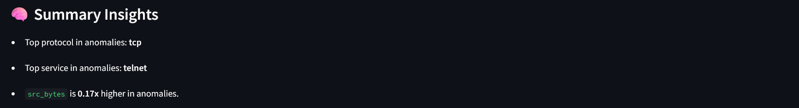

# 🛡️ Network Anomaly Detection Dashboard

A real-time dashboard to detect network anomalies using unsupervised machine learning (Isolation Forest) on the NSL-KDD dataset. Built with Streamlit for interactive UI and Python for backend logic.

## 🚀 Features
- Upload `.txt` or `.csv` files (NSL-KDD format)
- Unsupervised anomaly detection using Isolation Forest
- Smart summary insights: top protocols, services, byte patterns
- Visualizations with Plotly and Seaborn
- One-click anomaly report download
- Works in Jupyter Notebook + Streamlit dashboard

## 📦 Tech Stack
- Python 
- Streamlit
- scikit-learn
- pandas, numpy
- seaborn, matplotlib
- plotly

## 📸 Screenshots

## 📥 Dataset

We use the NSL-KDD dataset:
- [KDDTrain+.txt](https://github.com/defcom17/NSL_KDD/blob/master/KDDTrain%2B.txt)

This dataset is widely used for evaluating intrusion detection systems.

## 📊 Jupyter Notebook

You can also explore the detection logic step-by-step using:
- [`anomaly_detector.ipynb`](./anomaly_detector.ipynb)

